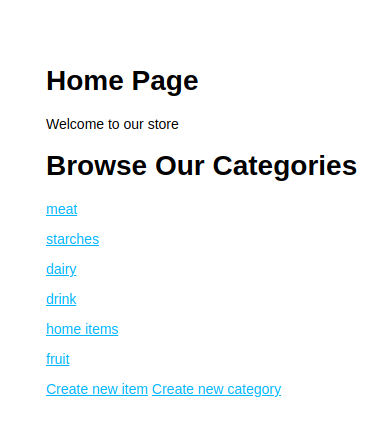

<h1>About This Project</h1> 
This project is an inventory management app for a grocery store, allowing users to perform all CRUD operations on both categories and individual food items. It provided valuable experience with Express.js, Node.js, and adhering to the MVC pattern for code structure.

 

<h1>What I learned</h1>
<ul>

<li>Utilized Express.js and middleware</li>
<li>Implemented the MVC pattern to structure the website and separate code</li>
<li>Performed form validation and sanitization</li>
<li>Used Node.js and Express.js to perform CRUD operations, including deleting food items and categories</li>
<li>Stored data securely using a MongoDB database</li>
<li>Passed data efficiently from the backend to the frontend</li>
<li>Employed EJS and views to render data</li>

 <h1>Build With</h1>

<h1>Getting Started</h1>

To get project cloned locally: git clone git@github.com:alecnissen/inventory-app.git

then `npm install` which will install all dependency's and packages.

<h1>Features</h1>

- Categories are displayed on the homepage.

- Users can view all the items within each category, and has options to delete both the category and the item.

- Users can view all the details of individual items.

- An option to create an item.

- An option to create a category.

<h1>Acknowledgments</h1> Thank you to everyone within The Odin Project Curriculum from the bottom of my heart! Thank you to anyone who helped me in the discord channels. I promise to help others throughout this journey.

<h1>Contact</h1>

Creator: Alec J Nissen
 
E-Mail: alecnissen@yahoo.com
 
GitHub: https://github.com/alecnissen/inventory-app
